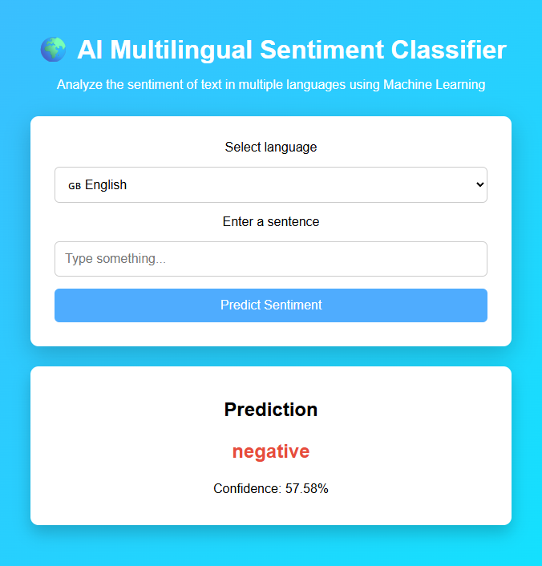

🌍 AI Multilingual Sentiment Classifier

# 🌍 AI Multilingual Sentiment Classifier

## Web Interface

A Machine Learning web application that analyzes the sentiment of text in multiple languages.

The system can classify sentences as positive or negative using Natural Language Processing and Machine Learning techniques.

Supported languages:

🇬🇧 English

🇪🇸 Spanish

🇩🇪 German

🇫🇷 French

The project includes model training, dataset management, and a responsive web interface built with Flask.

🚀 Features

Multilingual sentiment analysis

Machine Learning model training

Separate datasets for each language

TF-IDF text vectorization

Naive Bayes classification

Saved trained models using joblib

Interactive CLI prediction

Responsive Flask Web Application

Prediction confidence score

🖥 Web Interface

The application includes a responsive web interface where users can:

Select a language

Enter a sentence

Receive sentiment prediction and confidence score

Example

Sentence:

I love this game

Prediction:

Positive
Confidence: 92%
📸 Screenshot

🧠 Machine Learning Model

The sentiment classifier uses:

Feature Extraction

TF-IDF (Term Frequency – Inverse Document Frequency)

Classification Algorithm

Multinomial Naive Bayes

Each language has its own trained model.

📂 Project Structure
ai-text-classifier
│
├── dataset
│   ├── english_reviews.csv
│   ├── spanish_reviews.csv
│   ├── german_reviews.csv
│   └── french_reviews.csv
│
├── model
│   └── train_model.py
│
├── models
│   ├── english_model.pkl
│   ├── spanish_model.pkl
│   ├── german_model.pkl
│   └── french_model.pkl
│
├── static
│   └── style.css
│
├── templates
│   └── index.html
│
├── screenshots
│   └── web_app.png
│
├── app.py
├── predict.py
├── requirements.txt
└── README.md
⚙️ Installation

Clone the repository:

git clone https://github.com/albertorm005/ai-text-classifier.git
cd ai-text-classifier

Install dependencies:

pip install -r requirements.txt
🏋️ Train the Models

Run the training script:

python model/train_model.py

This will generate trained models inside the models folder.

Example output:

Training model for english...
english model accuracy: 0.80

Training model for spanish...
spanish model accuracy: 0.82
💻 Running the Web Application

Start the Flask application:

python app.py

Open in your browser:

http://127.0.0.1:5000
💬 CLI Prediction (Optional)

You can also run predictions from the terminal:

python predict.py

Example:

Choose language:
1 English
2 Spanish
3 German
4 French

Enter sentence:
Me encanta este juego

Prediction: positive
Confidence: 88%
📊 Dataset

Each dataset contains 50 labeled sentences:

25 positive

25 negative

The datasets are separated by language.

Increasing dataset size would significantly improve model accuracy.

🛠 Technologies Used

Python

Pandas

Scikit-learn

Flask

Joblib

TF-IDF Vectorization

Naive Bayes

HTML

CSS

⚠ Limitations

The current dataset is relatively small, which may affect prediction accuracy.

For better performance, the model should be trained with larger and more diverse datasets.

🚀 Future Improvements

Possible improvements for the project:

Automatic language detection

Larger multilingual datasets

Deep Learning models (BERT / Transformers)

REST API

User sentiment history

Visualization of prediction probabilities

Deploy the application online

👨‍💻 Author

Developed as a Machine Learning portfolio project.

Author:

Alberto Rodríguez

⭐ If you like this project

Give the repository a star ⭐ on GitHub!